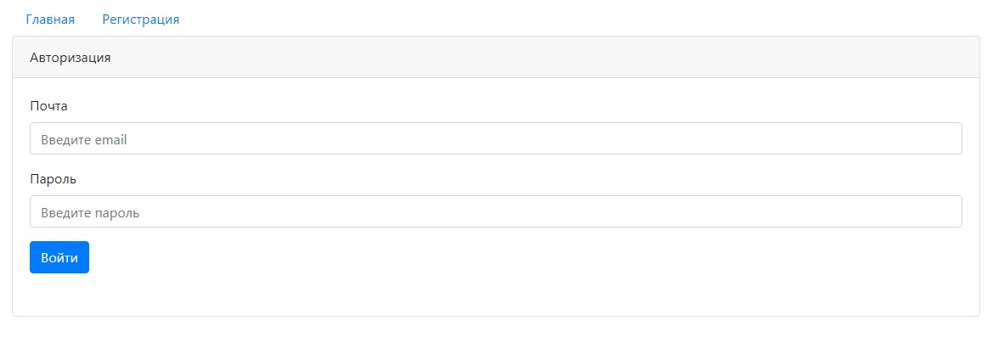
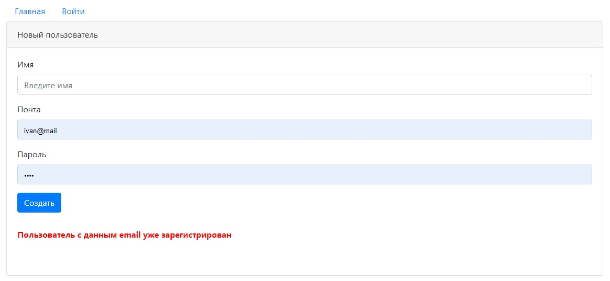
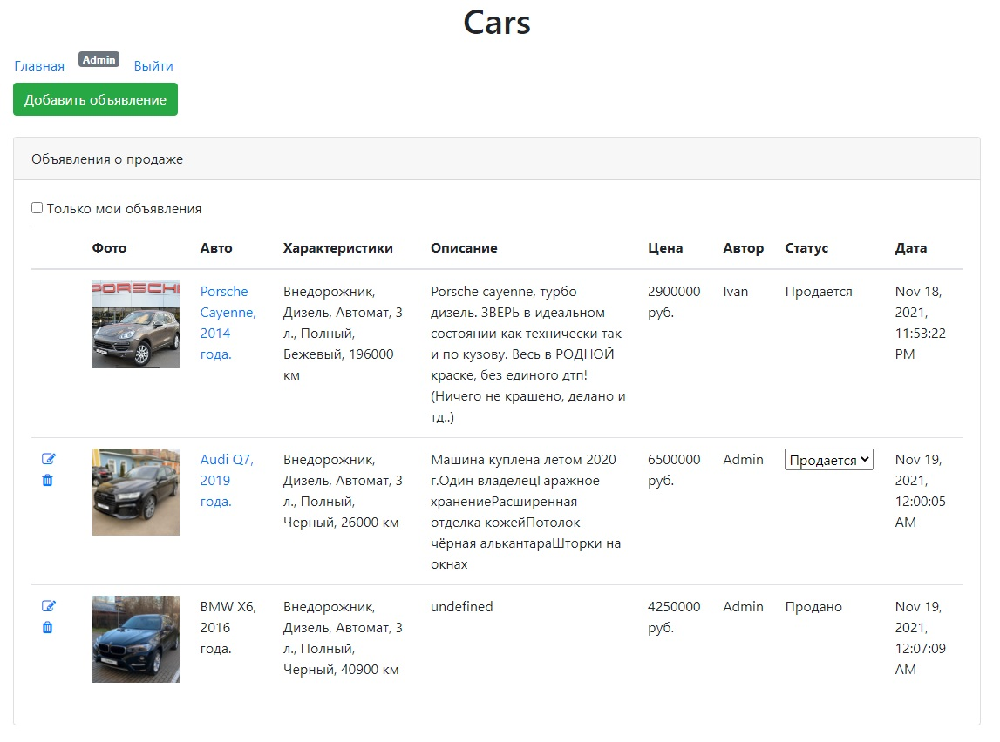
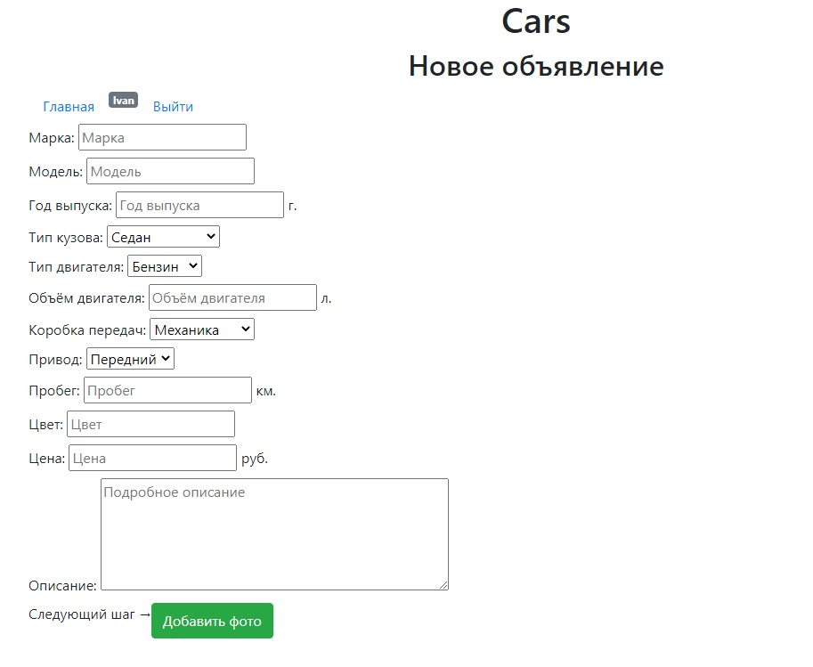
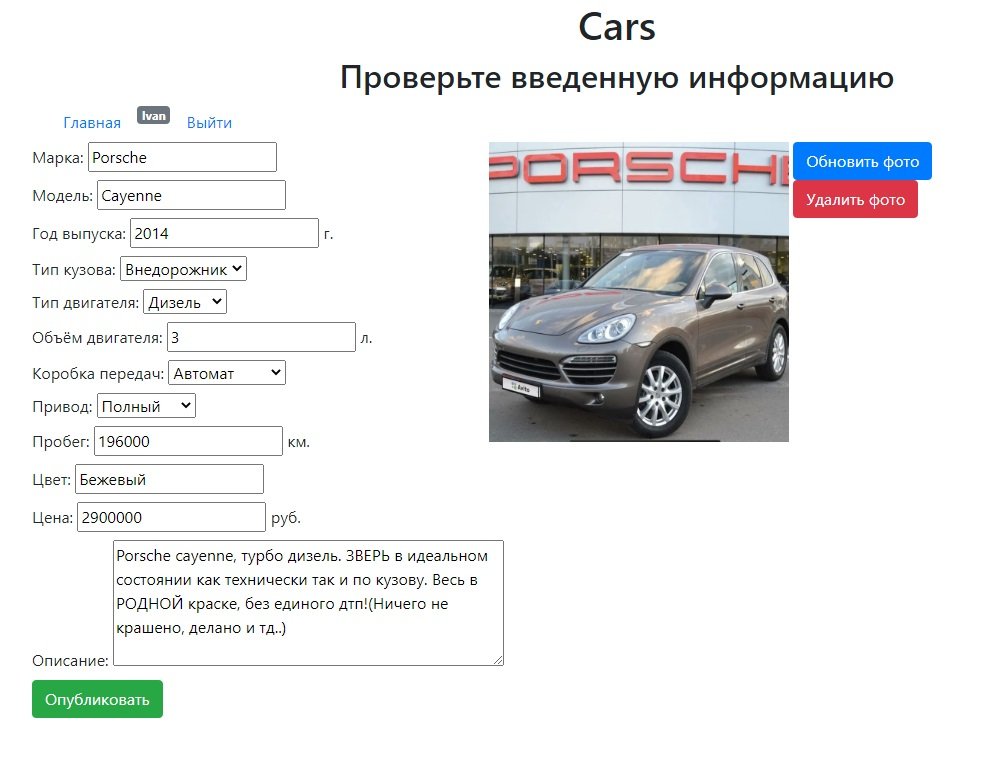
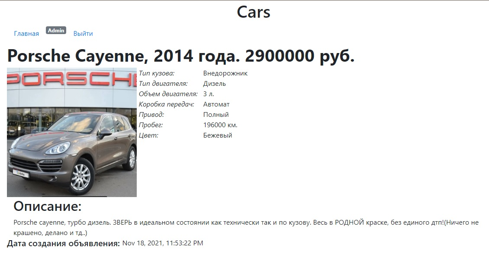
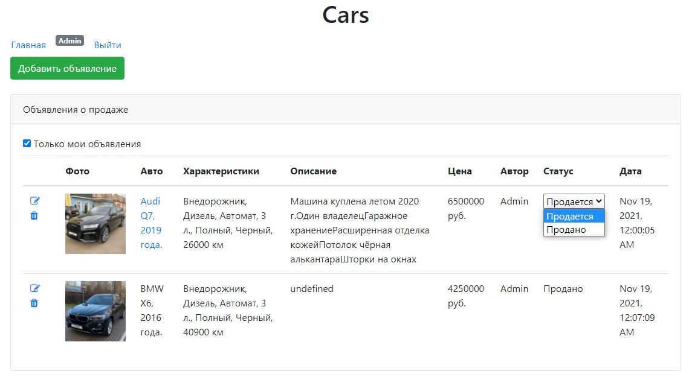

# Job4j_cars

## О проекте:

Job4j_cars - вэб приложение, площадка для продажи машин. 
Зарегистрированные пользователи могут публиковать объявления
о продаже автомобиля и просматривать объявления других пользователей.
Также зарегистрированный пользователь может редактировать, удалять, 
обновлять фото и менять статус с "Продается" на "Продано" в своих объявлениях.

Использованы технологии:

- Java EE / Servlets API
- Hibernate / JPA
- HTML, CSS
- JS (jQuery, AJAX)
- JSP
- PostgreSQL
- Tomcat
- Maven

## Сборка и установка:
Сборка проекта с помощью Maven в WAR-архив для последующего
развертывания в контейнере сервлетов (Apache Tomcat и т.п.).

`mvn inslall`

Скрипты для базы данных: db/schema.sql

## Контакты:
Если у вас есть какие-либо вопросы, не стесняйтесь обращаться ко мне:

Евгений Зайцев

[cyberfuzzapps@gmail.com](mailto:cyberfuzzapps@gmail.com)
